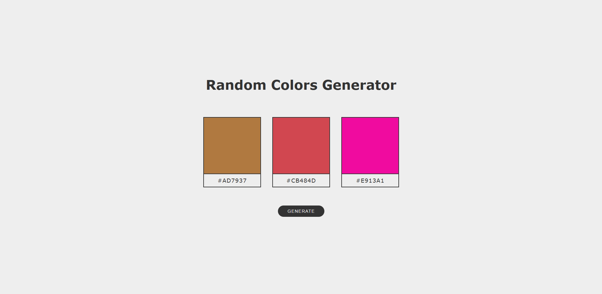
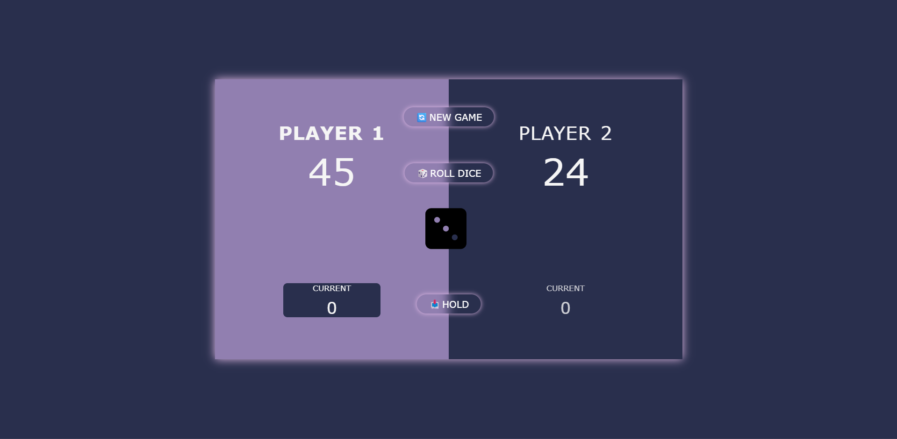

# Use-Less Projects

A collection of small, simple, and mostly use-less projects built with plain HTML, CSS, and JavaScript.
This repository includes old learning projects and new random experiments created for fun, curiosity, or practice.

## Projects

### Random Color Generator

### The pig game

# License

This repository is open source and available under the MIT License.
